GIT:

don't work off of  `main`- make a new branch 

**Two ways to make a new branch off of main**

1. on `github.com`:
    click the "<#> branches" between the current branch & tags button (in this pic it says `2 branches`)
    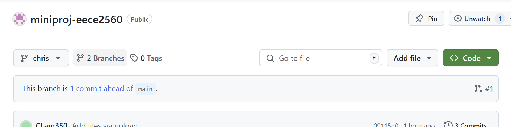

    Green button for new branch
    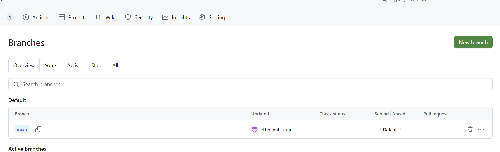

    Make the source `main` (or the branch u want ur code to come back to)
    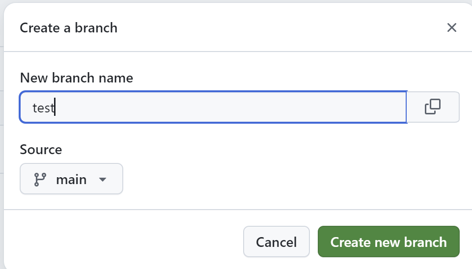
    

2. in ur terminal
    push up any un-commited/un-pushed changes (check below)

    - start from main `git checkout main`
    - pull any new changes to main `git pull`
    - create a new branch & switch to it `git checkout -b <###new branch name###>`

**After making the branch**
-

**Making commits**
    
1. do this while on your branch (run `git branch` to check), it should also say in the bottom left corner of your VSCode window
    
2. check all your changed files in VSCode under the Source Control tab
    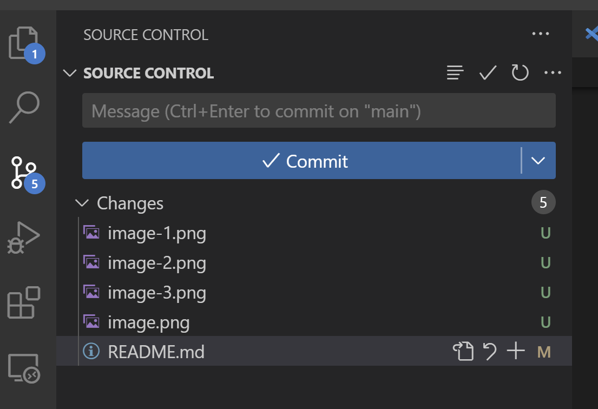

3. Stage what files you want others to see by hitting the `+` button & the file(s) should moved to a "Staged Changes" section
    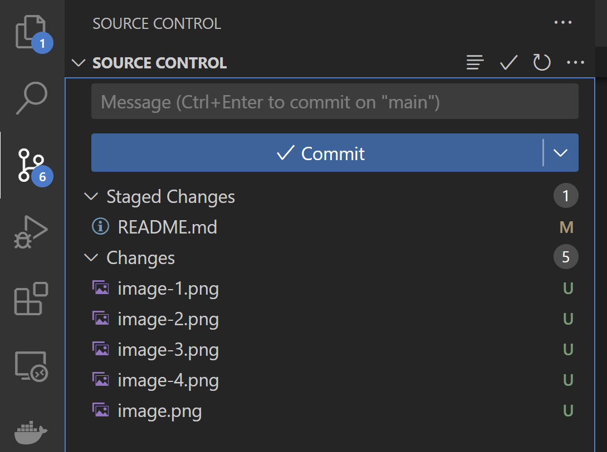

4. Enter a message to describe your changes & hit commit 
    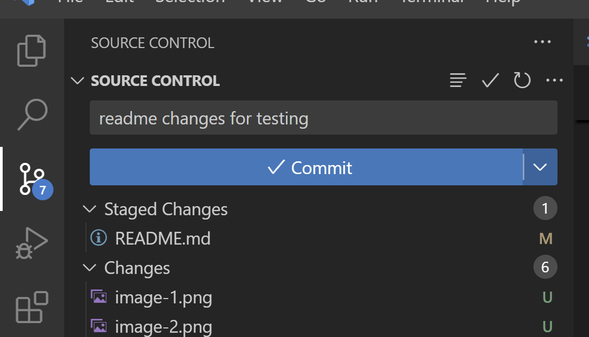

5. PUSH! (This will make your changes visible on the GitHub website- still only on your branch) two options:

    - hover over the top right corner of the Source Control Graph section & hit the button arrows upwards (Push)
        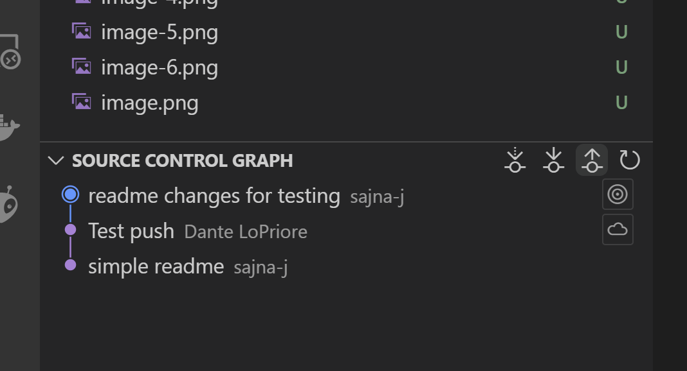

        OR

    - in a terminal from the `miniproj-eece2560` directory, run `git push`

**turn your branch into a Draft PR so that you can see your commit history**

1. Click either `Contribute` > `Open pull request` or if you see your branch in this yellow dialog appear, hit `Compare & pull request`
    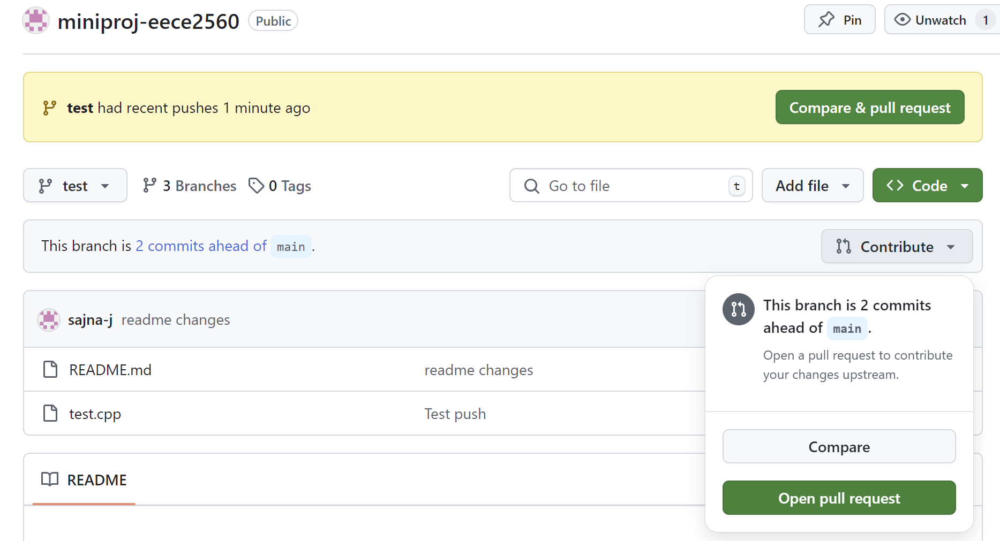

2. Turn the pull request into a Draft Pull Request with the green button
    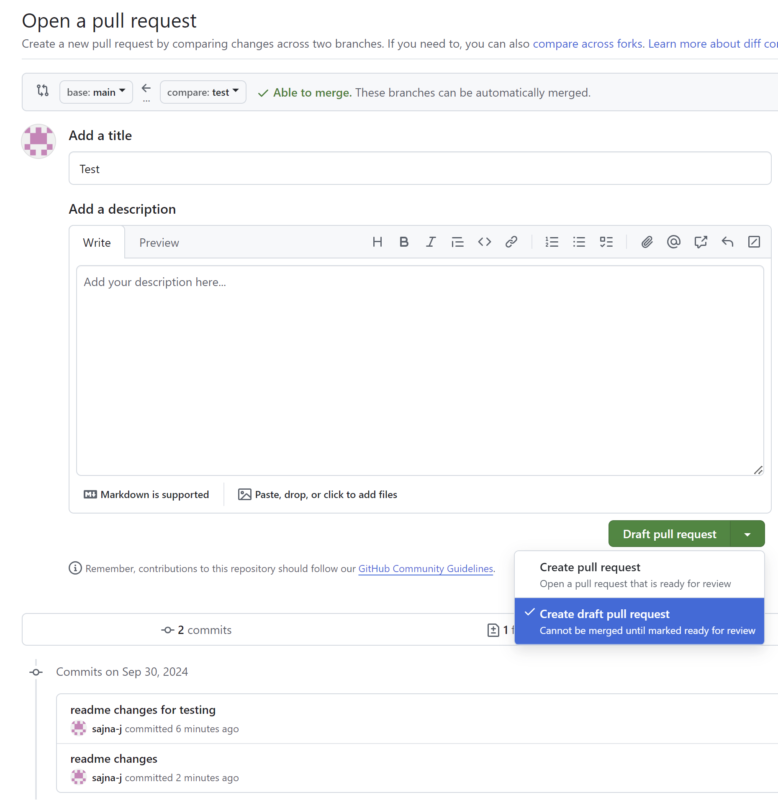

3. keep making changes and commits+pushes until you are done. it should look something like:
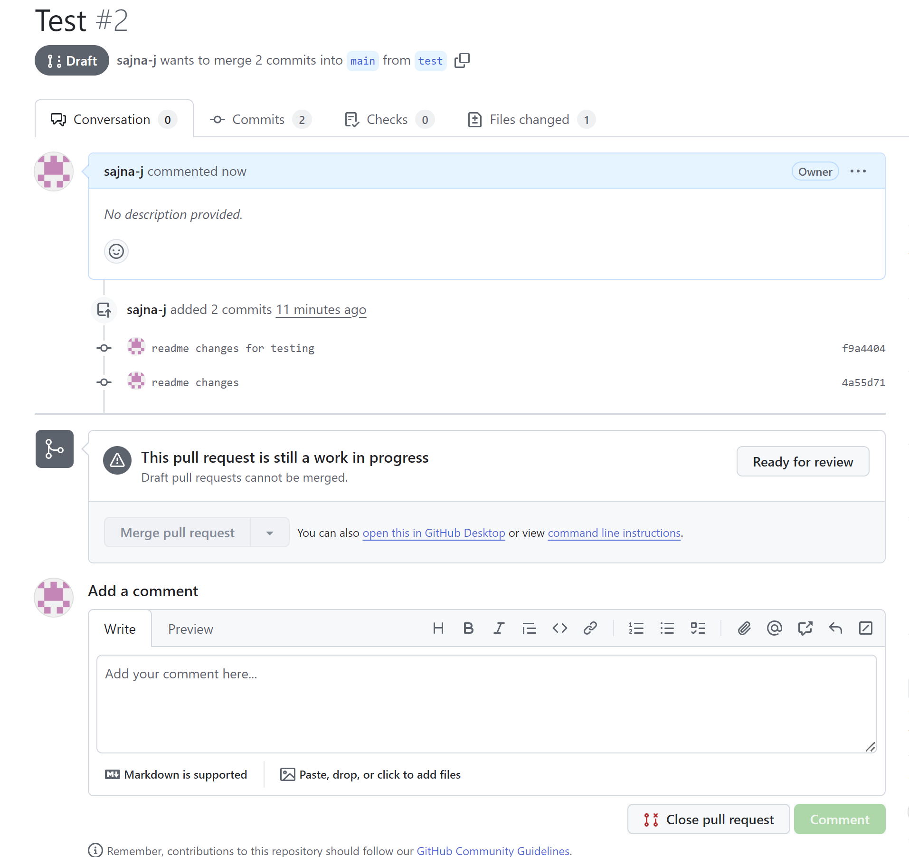

4. when you're done, hit the `Ready for review` button in the previous pic

5. You can (optionally, but recommended) request others on the team to review the PR before it goes into `main`
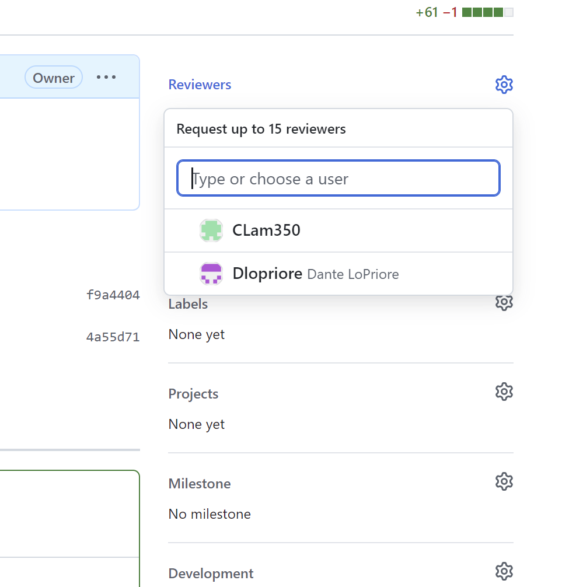

6. Once the reviewers have approved, you can Merge PR with the big green button
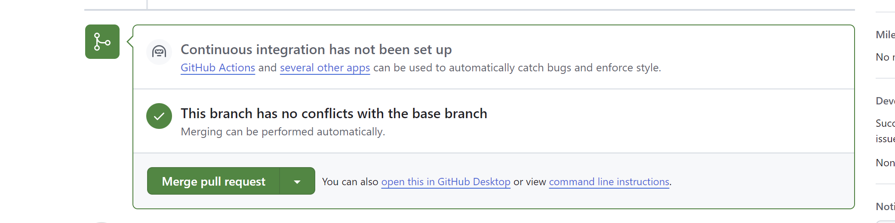

